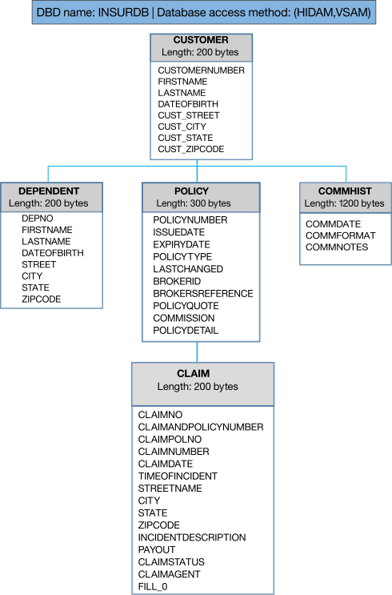

# ims-devops-create-db
Create a sample database with options to use DDL commands (coming soon)

## Sample IMS Insurance database overview

The CUSTOMER table contains information about the insurance company customer. Each customer can have many policies, which are stored in the POLICY table. If there are any claims that are associated with a policy, that information would be stored in the CLAIMS table. In addition, a customer can have zero to many dependents such as a child or spouse, which would be stored in the DEPENDENT table. All communications with a customer whether through a phone operator, an online chat rep, or the email system is stored in the COMMUNICATION table.

Figure 1. Database structure for the sample IMS Insurance company

## Repository structure

* `\dbsource`
  * `DEMODATA`: A set of DFSDDLT0 statements to insert segments into the Insurance database
  * `DEMODB`: The DBD for the Insurance Database. This DBD includes definitions for all the fields in the database, so that IMS SQL can be used to access the database.
  * `DEMODBRC`: The JCL to define the Insurance Database to DBRC. 
  * `DEMODEF`: The JCL to define and initialize the Insurance Database.
  * `DEMODX`: The DBD for the Insurance Database secondary Index.
  * `DEMOLOAD`: The PSB used for loading the Insurance Database.
  * `DEMO01`: The PSB used for access to the Insurance Database.
* `\DDL` 
  * (Coming soon) DDL commands to create the IMS sample database 
* `\zOSMF`
  * (Coming soon) zOSMF workflow to create the IMS sample database

## Steps for creating IMS sample database

This repository provides 3 options for creating the IMS sample Insurance database:
* DDL
* z/OS MF
* Gen

### Steps for using DDL 

### Steps for using z/OS MF

### Steps for using Gen

#### Set up the Insurance database DBD and PSB definitions
There are two DBDs and two PSBs to be generated. The source of these are `DBsource` folder. Use your standard DBDGEN process for the INSURDB and INSURDX databases, and your standard PSBGEN process for the DEMOLOAD and DEMO01 PSBs.

Once the DBDs and PSBs have been genned, perform an ACBGEN to add them to your Application Control Block library. If you are using the IMS Catalog, these definitions can be optionally loaded into the Catalog during the ACBGEN process, or later if desired.

#### Define the database to DBRC
The DEMODBRC member contains the JCL and statements to define the Insurance databases to DBRC. You need to tailor this job with the names of the IMS datasets used in your environment.

#### Define the database data sets and load the database
The DEMODEF member contains the JCL and parameters to
1. Define the VSAM datasets used for the Insurance database
2. Initially load and then delete a dummy segment to the Insurance database 
3. Load segments into the Insurance database.
You will need to tailor this job with the names of the IMS datasets used in your environment. If you make a mistake, the job deletes any database data sets that were previously allocated, so you can run it multiple times if needed.

